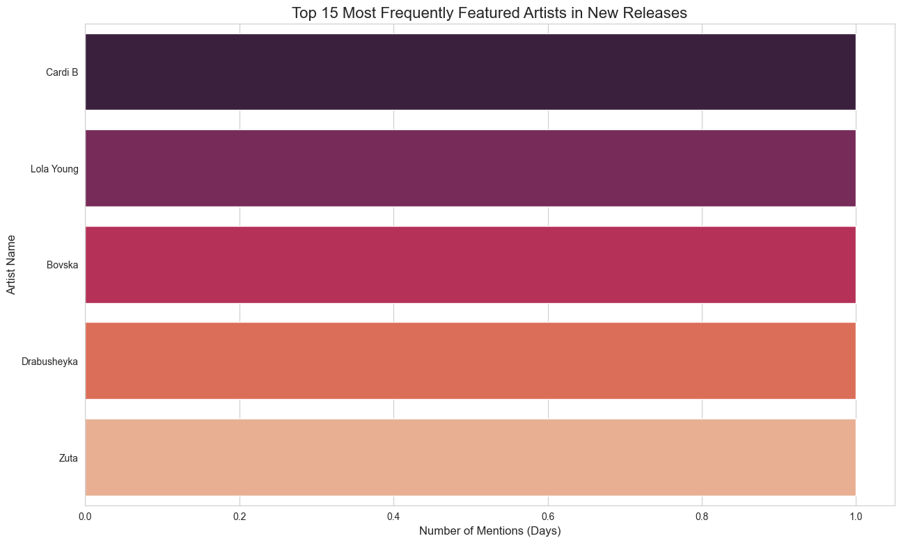

# Automated Spotify Data Pipeline

### A data engineering project that demonstrates how to build an automated, daily ETL pipeline using the Spotify API and GitHub Actions.


## Project Overview

This project showcases a complete, end-to-end data pipeline. It goes beyond simple data analysis of a static file and demonstrates the ability to:
1.  **Extract:** Automatically fetch data from a live, external source (the Spotify API).
2.  **Transform:** Process the raw JSON response into a clean, tabular format.
3.  **Load:** Append the new data to a persistent CSV file, building a historical dataset over time.

The entire process is automated to run **daily** using a **GitHub Actions workflow**, making it a true set-and-forget data pipeline. The project is completed with a Jupyter Notebook that analyzes and visualizes the collected data.

## Key Features & Skills Demonstrated

*   **API Integration:** Connecting to the Spotify Web API, handling authentication (Client Credentials Flow), and making GET requests.
*   **Data Automation (CI/CD):** Building a GitHub Actions workflow that runs a Python script on a schedule (`cron`).
*   **ETL Pipeline:** The script performs a simple ETL (Extract, Transform, Load) process.
*   **Data Persistence:** The pipeline builds its own dataset by appending new data to a CSV file each day.
*   **Data Analysis & Visualization:** A separate Jupyter Notebook (`analysis.ipynb`) is included to analyze the collected data and visualize the results.
*   **Credential Management:** Secure handling of API keys using environment variables and GitHub Secrets.

## Technical Stack

*   **Language:** Python 3.13
*   **Core Libraries:** Pandas, Requests, python-dotenv
*   **Automation:** GitHub Actions
*   **Analysis:** Jupyter Notebook, Seaborn, Matplotlib

## How to Run This Project

1.  **Set up Spotify API Credentials:**
    *   Go to the [Spotify Developer Dashboard](https://developer.spotify.com/dashboard/) and create an app.
    *   Create a local `.env` file and store your credentials:
      ```
      SPOTIPY_CLIENT_ID='YOUR_CLIENT_ID'
      SPOTIPY_CLIENT_SECRET='YOUR_CLIENT_SECRET'
      ```

2.  **Clone the repository and set up the environment:**
    ```bash
    git clone https://github.com/YOUR_USERNAME/spotify-data-pipeline.git
    cd spotify-data-pipeline
    uv venv
    source .venv/bin/activate
    uv pip install -r requirements.txt
    ```

3.  **Run the pipeline script manually to generate initial data:**
    ```bash
    python spotify_tracker.py
    ```

4.  **Set up GitHub Secrets for automation:**
    *   In your GitHub repository, go to `Settings > Secrets and variables > Actions`.
    *   Add two repository secrets: `SPOTIPY_CLIENT_ID` and `SPOTIPY_CLIENT_SECRET` with your credentials. The GitHub Actions workflow will use these to run automatically.

## Analysis Results

The collected data is analyzed in `analysis.ipynb`. Below is an example of the output, showing the most frequently featured artists in Spotify's "New Releases" over time.


*This chart will be automatically updated by the pipeline as it collects more data over the days.*